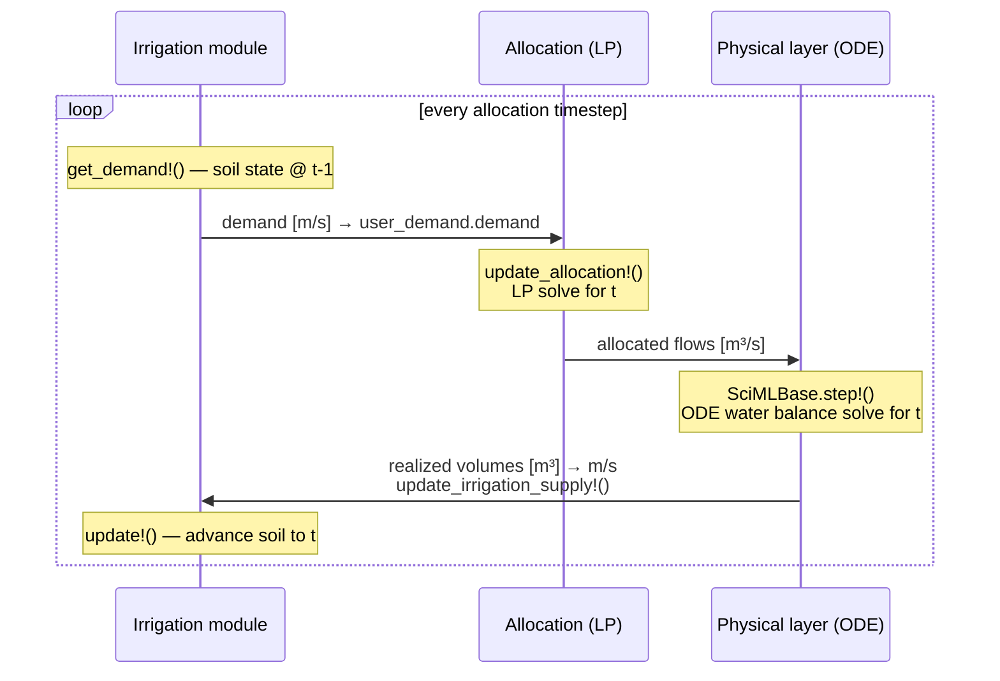

# Irrigation

A self-contained Julia module that wraps Wflow's SBM land-surface components (soil, interception, runoff, water demand) into a lightweight irrigation model. Designed as a prototype for coupling Wflow soil physics with an external water allocator such as Ribasim.

## Structure

```
irrigation/
├── Project.toml               # Julia environment (pinned Wflow source)
├── Manifest.toml              # Exact dependency versions
├── README.md
├── src/
│   ├── irrigation.jl          # Irrigation module (wraps Wflow components)
│   └── irrigation_utils.jl   # Config structs, forcing, logger
└── example/
    ├── coupled_simulation.jl  # Coupled Ribasim + irrigation run
    ├── run_irrigation_standalone.jl  # Standalone run with plots
    ├── run_irrigation_coupled.py     # Python driver: generate model + run
    └── plot_results.py        # Result visualisation
```

## Requirements

- Julia ≥ 1.11
- All dependencies (including Wflow) are pinned in `Project.toml` / `Manifest.toml` — no manual setup needed

## Running the example

### Standalone (no Ribasim)

```
julia irrigation/example/run_irrigation_standalone.jl
```

Activates the `irrigation` environment and runs three scenarios, writing PNG plots to the working directory:

| Output file | Description |
|---|---|
| `single_column_no_allocation.png` | 30-day run, no irrigation |
| `single_column_allocation.png` | 30-day run, 50% allocation |
| `multi_column_allocation.png` | 4 cells with 100 / 75 / 25 / 0% allocation |

### Coupled (with Ribasim)

```
pixi run python irrigation/example/run_irrigation_coupled.py
```

Generates the Ribasim GeoPackage model and runs `coupled_simulation.jl`, writing results to `irrigation/example/irrigation_model/coupled_irrigation.nc`.

The first run downloads and precompiles dependencies (including Wflow from GitHub and CairoMakie) — this takes a few minutes. Subsequent runs are fast.

## Wflow version

Wflow is pinned to a specific commit on the Deltares GitHub (`ea8754e`) which contains the 1.1.0-dev API used by this module. When Wflow 1.1.0 is released to the Julia registry, the `[sources]` block in `Project.toml` can be removed and replaced with a `[compat]` bound.

## Module API

```julia
include("irrigation/src/irrigation.jl")
using .Irrigation

# Initialise with default synthetic forcing (30 days)
m = Irrigation.init()

# Run without external allocation
Irrigation.update_until!(m, 30 * m.dt)

# Or step manually and inject allocation each day
m = Irrigation.init(; n = 4)          # 4 independent soil columns
for step in 1:30
    demand = Irrigation.get_demand(m)           # [m/s], length n
    Irrigation.set_allocated!(m, demand .* 0.5) # supply 50% of demand
    Irrigation.update_until!(m, step * m.dt)
end
```

### Key functions

| Function | Description |
|---|---|
| `Irrigation.init(; forcing, n, soil_cfg, veg_cfg, irr_cfg)` | Create model with `n` independent soil columns |
| `Irrigation.get_demand!(m)` | Compute irrigation demand [m/s] from soil moisture deficit |
| `Irrigation.set_allocated!(m, alloc)` | Set external irrigation supply [m/s] for next timestep |
| `Irrigation.update!(m)` | Advance model one `dt` step |
| `Irrigation.update_until!(m, t_end)` | Advance model to time `t_end` [s] (standalone use) |
| `Irrigation.finalize!(m, path; ...)` | Flush logger to NetCDF |

### Configuration

Pass keyword structs to `init()` to override defaults:

```julia
soil = Irrigation.SoilConfig(theta_s = 0.50, ksat_surface = 1e-6)
veg  = Irrigation.VegetationConfig(rooting_depth = 0.8)
irr  = Irrigation.IrrigationConfig(irrigation_efficiency = 0.9)
m = Irrigation.init(; soil_cfg = soil, veg_cfg = veg, irr_cfg = irr)
```

## Coupling with Ribasim

The module is designed so that `get_demand` / `set_allocated!` map directly to BMI `get_value` / `set_value` calls. In a coupled run Ribasim reads the demand, routes water through its network, and returns the achievable allocation (which may be less than demand).

### Coupling concept

Each timestep follows this update pattern:



### Online coupling API

```julia
# initialise
Irrigation.init()

# Ribasim.solve!(model)
    for each allocation timestep
        Irrigation.get_demand!()        # [m/s] — soil state @ t-1
        → LP solve → ODE step
        Irrigation.set_allocated!(realized)
        Irrigation.update!()            # advance soil to t
    end

# finalize to flush logger
Irrigation.finalize!()
```
