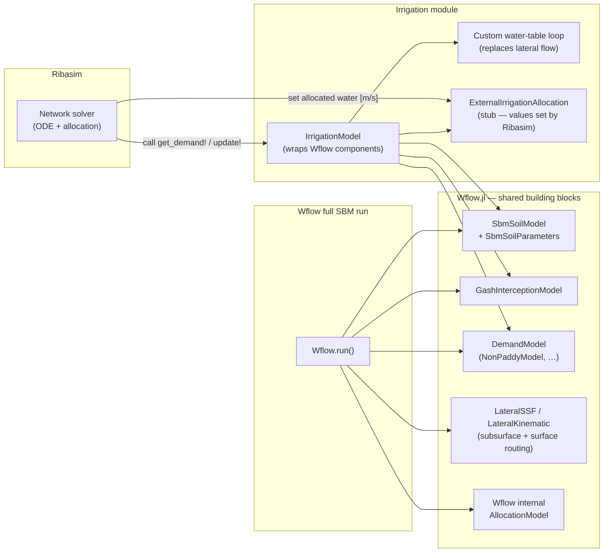

# Dependency Graph: Ribasim · Irrigation · Wflow

## How Ribasim, Irrigation and Wflow share the SBM components

**Key difference:** Wflow's full SBM run routes water laterally between cells via `LateralSSF`/kinematic wave.
The `Irrigation` module uses the same vertical soil physics but replaces lateral flow with a single-column water-table update — because each irrigated cell is treated independently, with Ribasim handling the inter-cell water distribution.

## Model parts vs. parameters

### Model parts (state / behaviour)

| Field | Type | Source |
|---|---|---|
| `soil` | `SbmSoilModel` | Wflow |
| `interception` | `GashInterceptionModel` | Wflow |
| `runoff` | `OpenWaterRunoff` | Wflow |
| `demand` | `DemandModel` | Wflow |
| `allocation` | `ExternalIrrigationAllocation` | local stub |
| `snow` | `NoSnowModel` | Wflow |
| `glacier` | `NoGlacierModel` | Wflow |
| `atmospheric_forcing` | `AtmosphericForcing` | Wflow |

Sub-models inside `DemandModel`:

| Field | Type |
|---|---|
| `domestic` | `NoNonIrrigationDemandModel` |
| `industry` | `NoNonIrrigationDemandModel` |
| `livestock` | `NoNonIrrigationDemandModel` |
| `paddy` | `NoIrrigationPaddyModel` |
| `nonpaddy` | `NonPaddyModel` |

### Parameter structs (configuration / static data)

| Struct | Used by | Shared? |
|---|---|---|
| `VegetationParameters` | `SbmSoilParameters`, `GashParameters` | **yes** — single instance passed to both |
| `SbmSoilParameters` | `SbmSoilModel` | — |
| `KvExponential` | `SbmSoilParameters` (kv_profile field) | — |
| `GashParameters` | `GashInterceptionModel` | — |
| `NonPaddyParameters` | `NonPaddyModel` | — |
| `DemandVariables` | `DemandModel` | — |

### Local config structs (irrigation_utils.jl)

| Struct | Purpose |
|---|---|
| `VegetationConfig` | User-facing vegetation defaults → mapped to `VegetationParameters` |
| `SoilConfig` | User-facing soil defaults → mapped to `SbmSoilParameters` |
| `IrrigationConfig` | Irrigation efficiency / max rate → mapped to `NonPaddyParameters` |

## Key design notes

- **Wflow** is a hard dependency of `Irrigation` — all soil/interception/demand types come from it.
- **Ribasim** and **Irrigation** are **not coupled at the package level**. The coupling happens at runtime in `coupled_simulation.jl` by injecting three function pointers (`irr.model`, `irr.compute_demand!`, `irr.advance!`) into Ribasim's parameter struct.
- `VegetationParameters` is created once and **shared** between `SbmSoilParameters` and `GashParameters`.
- The custom water-table loop (per-cell `water_table_change` → `update_ustorelayerdepth!`) replaces the lateral groundwater component that a full Wflow SBM model would use.
